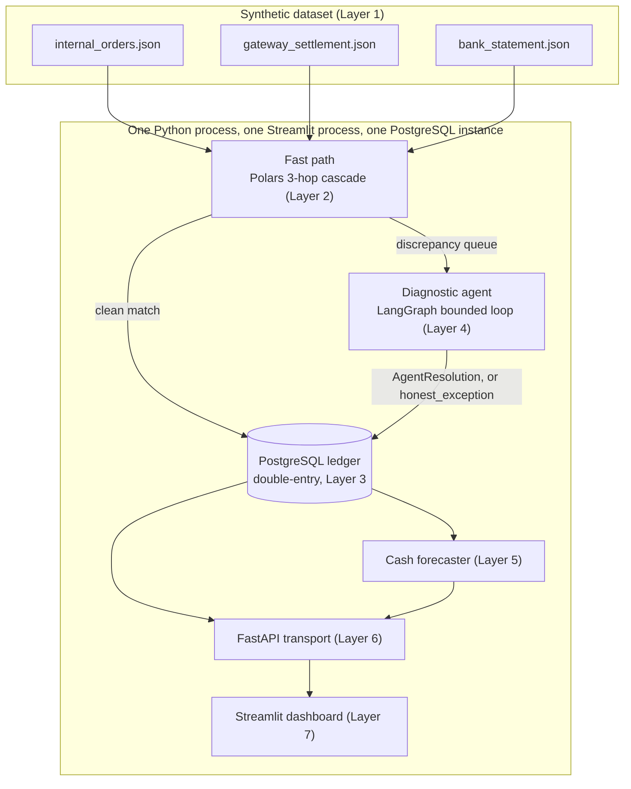

# ZeroDrift

An AI-assisted reconciliation engine that matches orders, gateway settlements, and bank statements — and is honest about the cases it can't confidently resolve, instead of guessing. Built for Razorpay Buildathon Track 04.

## Architecture



**This is a modular monolith, not distributed.** Every box inside "Monolith" above is a Python module called in-process — plain function calls, not network calls between services — sharing one PostgreSQL instance via SQLAlchemy. There is no message broker, no service mesh, no cross-service failure handling, and no Kafka/Spark/streaming layer anywhere in this system. That's a deliberate choice, not a shortcut: this project's correctness claim rests on single ACID transactions (a journal entry and its lines post together or not at all — see the ledger section below) and on being able to reason about the whole pipeline in one process's call stack. A distributed version of this system would trade that provable correctness for operational complexity this problem doesn't need. The only Razorpay-internal fact this build leans on is verified: Agent Studio runs on Anthropic's Claude Agent SDK.

## Domain model

**Money.** `Decimal`, parsed from `str`, at every Pydantic boundary — a `field_validator` rejects a `float` literal outright. Inside Polars, money is integer **paise** (`Int64`), never an inferred/`Float64` column. In Postgres, `NUMERIC`. Exactly two functions convert between the two representations, `to_paise()` / `from_paise()` (`src/common/money.py`), with a zero-drift round-trip test over the full frozen dataset — no ad-hoc conversion exists anywhere else in the codebase.

**Fees, computed per settlement:**
```
gst_on_mdr  = mdr × 18%                    (GST_RATE, src/data/generator.py)
tds_194o    = gross_amount × 0.1%          (TDS_RATE — Section 194-O, reduced from 1% effective 2024-10-01)
net_amount  = gross_amount − mdr − gst_on_mdr − tds_194o     (exact, zero-tolerance invariant)
```
GST paid on the MDR fee is Input Tax Credit — an **asset** (`GST_ITC_RECEIVABLE`), not a liability. TDS withheld under Section 194-O is an advance tax paid on the merchant's behalf — also an **asset** (`TDS_194O_CREDIT`). Every account in the chart of accounts is classified from the **merchant's** books, not the gateway's or the bank's.

**194-O modeling assumption, stated plainly:** this project models the merchant as an e-commerce participant settling through an operator who deducts tax under Section 194-O. It does not resolve the broader, genuinely unsettled debate about whether a pure payment aggregator (as opposed to a marketplace operator) is in scope of that section — that question is left open deliberately here, not dodged.

**UPI has nil MDR, by regulation.** UPI P2M transactions carry zero merchant discount rate, so every UPI record has `mdr = 0` and `gst_on_mdr = 0` with no exceptions — enforced as a Pydantic model validator on `GatewaySettlement` (`src/data/models.py`), not just a generator convention. A UPI settlement with a nonzero MDR line simply cannot be constructed; the generator is correspondingly forbidden from ever placing a `missing_tax_line` anomaly on a UPI record, since "a UPI record with a nonzero tax line to omit" isn't a real transaction that could occur.

## Ledger: largest-remainder UTR batch allocation

Splitting an integer-paise lump-sum bank credit across the 2–4 orders in a `utr_batch` record by naive proportional division almost always leaves 1 to N−1 paise unallocated — enough to fail the ledger's own balance trigger. `src/ledger/allocation.py::allocate_utr_batch` instead floors each order's exact proportional share, then hands out the leftover paise one each to the orders with the largest fractional remainder, so the split always sums exactly to the real bank credit. Any residual larger than that (which would signal an upstream bug, not ordinary rounding) is capped at `±N` paise per batch and posts to a dedicated **`ROUNDING_DIFFERENCE`** expense account instead of being fudged into any one order's amount — asserted directly in `tests/test_ledger.py`, never silently swallowed. On the frozen `challenge_batch_100` dataset every `utr_batch` record allocates with zero residual, so `ROUNDING_DIFFERENCE` carries no activity in that scorecard below — the account exists in the schema for the case where it's needed, and this run happens not to need it.

## Running locally

```
docker compose up -d          # Postgres only -- see docker-compose.yml
source venv/Scripts/activate  # or venv/bin/activate on macOS/Linux
uvicorn src.api.main:app --reload --port 8000
streamlit run src/dashboard/app.py
```

The API applies `src/ledger/db_schema.sql` to the `finance_controller`
database itself on startup if the schema isn't already there (see
`ensure_schema_exists` in `src/ledger/models.py`) -- so a fresh
`docker compose up` (or a `docker compose down -v` reset) doesn't need a
manual `psql -f db_schema.sql` step; the first `uvicorn` start creates it.
`pytest` never touches this database -- it provisions and resets its own
`finance_controller_test` database (`tests/conftest.py`).

## Scorecard

The deterministic block is exact and byte-reproducible for the frozen dataset — regenerated by re-running `python evaluate.py --skip-agent-block` and pasting the real output, never hand-typed (`tests/test_packaging.py` asserts this block matches a fresh run on every test invocation, so it cannot silently drift).

<!-- SCORECARD:DETERMINISTIC:START -->
```text
=== Deterministic block (exact, byte-reproducible for this batch) ===
Fast path resolved:       63 / 100
Agent resolved:           20 / 100
Honest exceptions:        17 / 100
False auto-resolutions:   0   (must be 0)
Adversarial traps caught: 5 / 5   (must be 5/5)
Duplicate credits caught: 2 / 2   (must be 2/2)
Ledger balance check:     PASS
Paise round-trip drift:   0   (asserted 0)

Trial balance (paise):
  AR_GATEWAY_CLEARING      debit=    24,809,496 credit=    25,070,336 net=      -260,840
  CASH                     debit=    27,022,633 credit=             0 net=    27,022,633
  CASH_IN_TRANSIT_UTR      debit=     2,661,609 credit=     2,661,609 net=             0
  GST_ITC_RECEIVABLE       debit=        51,209 credit=             0 net=        51,209
  MDR_EXPENSE              debit=       302,375 credit=             0 net=       302,375
  REVENUE_GROSS            debit=       260,840 credit=    24,809,496 net=   -24,548,656
  SUSPENSE_UNRESOLVED      debit=     1,363,516 credit=     3,952,947 net=    -2,589,431
  TDS_194O_CREDIT          debit=        22,710 credit=             0 net=        22,710
  TOTAL                    debit=    56,494,388 credit=    56,494,388 net=             0
```
<!-- SCORECARD:DETERMINISTIC:END -->

**Agent block — 3 independent live runs, complete.** The agent path is genuinely non-deterministic (CLAUDE.md Sec.5), so this is reported as a min/median/max range across 3 independent live runs, never a single number. All three ran against the frozen dataset with zero cache reuse between them (`data/agent_runs/frozen_1.jsonl`, `frozen_2.jsonl`, `frozen_3.jsonl`), gathered across multiple sittings under Groq's free-tier 200,000-token daily cap — real timestamps days apart, exactly the methodology note above describes, not a shortcut. Zero malformed-output fallbacks across all 111 record-diagnoses (37 × 3).

<!-- SCORECARD:AGENT:START -->
```text
=== Agent block (3 independent live runs -- range, never a single number) ===
Agent resolved (per run):           [20, 20, 20]  out of 20
  min / median / max:               20 / 20 / 20
Correct root_cause_code (per run):  [20, 20, 20]  out of 20
Correct quantified_delta (per run): [19, 18, 19]  out of 20
Honest exceptions from agent path: consistent across all 3 runs? Y
```
<!-- SCORECARD:AGENT:END -->

Root-cause identification was perfect across every run (20/20, all 3 sittings) and all 17 honest-exception records were routed consistently every time. The one real source of variance: `quantified_delta_paise` missed by 1 record on 2 of the 3 runs (19/20, 18/20, 19/20) — every miss traced to the same `cutoff_drift` category, where the model occasionally reports the settlement's full net amount as the delta instead of the correct 0 (fees genuinely matched; only timing was off). Left as a disclosed, real finding rather than "fixed" — it's exactly the kind of run-to-run agent variance this range exists to surface honestly, not paper over.

## Live seed batches: recommended size

**Recommend 60 records or fewer for a live (`source="seed"`) batch, not the frozen dataset's own 100.** A never-before-seen seed needs one real live Groq call per record needing agent judgment, against this key's hard 200,000-token daily cap — and that cap is not just a theoretical ceiling. Verified directly, not guessed (generating real batches and measuring against the real per-record cost, `src/agent/run_log.py::average_real_tokens_per_live_call`): **records=70 fits inside the usable budget (est. 184,389 tokens), records=75 does not (est. 198,048)**. Real per-record cost has ranged ~4,400–11,700 tokens depending on category mix, so 60 is deliberately kept below that measured boundary rather than sitting right at the edge.

Notably, **even the frozen dataset's own size does not fit a fresh day's budget on its own** — a brand-new 100-record seed needs an estimated 252,682 tokens, over the entire daily cap. Triggering `source="frozen"` only ever costs zero live tokens because its 37 discrepancy records are permanently cached (`data/agent_runs/layer4_test_cache.jsonl`), not because 100 records is a safe live-seed size in general. `RECOMMENDED_MAX_LIVE_SEED_RECORDS` (`src/agent/rate_limiter.py`) is the single source of truth for this number, surfaced on the dashboard's "Bring your own seed" card.

A batch that won't fit today's remaining budget fails cleanly with a clear message before any row is posted (`src/orchestration/batch_runner.py`'s pre-flight check) rather than posting partial results — see the RCA below for the full incident.

## RCA: real incidents from this build

Six real incidents, in build order, each tied to a real commit (or, for the one that never touched code, independently reproduced live before writing a single number here) — never invented for the sake of having war stories. CLAUDE.md's integrity rule leaves no other option: nothing below is written unless it was actually run.

### 1. The Layer 4 marathon: five real bugs and two burned API keys (2026-08-31)

**What broke.** Getting the diagnostic agent live-tested against all 37 agent-graded records in the frozen dataset surfaced five distinct, real bugs — each found by an actual live failure, not reasoned out in advance:

1. **Tool-binding/pseudo-tool bug.** Describing the final-answer JSON schema in the same turn as bound tools made `openai/gpt-oss-120b` sometimes wrap a premature answer as a call to a synthetic `"json"` tool absent from the bound tool list, which Groq's API then rejected with a 400 — and once let through, this let an `adversarial_trap` force-match. Fixed by splitting `FINAL_ANSWER_INSTRUCTION` out of `SYSTEM_PROMPT`, shown only after tools are no longer bound.
2. **Candidate-discovery bug.** Candidate orders were matched against order gross amount/timestamp instead of settlement net amount/settlement date — the generator jitters `adversarial_trap` decoys around the twin order's *settlement*, not the order itself, so real candidates were never found. Fixed in `discrepancy.py::find_candidate_orders`.
3. **AMEX_SURCHARGE vs INTL_MARKUP priority (`ORD1069`).** `get_tax_rules`' `expected_mdr_paise` is the domestic standard rate regardless of internationality, so an international transaction always shows an "overage" against it even when nothing is wrong beyond the markup itself. The model was deciding from MDR magnitude alone instead of the `is_international` field already in hand. Fixed with an explicit precedence rule in `SYSTEM_PROMPT` — verified live on a fresh key: both `ORD1069` and `ORD1080` then got the right `root_cause_code`.
4. **`quantified_delta_paise` sign/composition bug.** Never specified, so the model reported signed actual-minus-expected deltas (`ORD1080`: `-346` instead of `346`) and, separately, summed a fee delta with its own downstream GST-on-MDR consequence into one figure (`ORD1069`: `5268` instead of `4464` — GST-on-MDR moves with MDR automatically, it isn't a second independent deviation). Fixed with an explicit non-negative-magnitude, MDR-only rule.
5. **CUTOFF_T1/CUTOFF_T2 semantics (`ORD1067`).** Never defined anywhere in the prompt. The model computed the right facts (expected vs. actual business-day gap) and reasoned correctly about them, then keyed the code to the *actual observed* gap instead of the rail's own *standard* window. Fixed with an explicit definition tied to `expected_window_business_days`.

**The process failure underneath all five.** `AGENT_LOGIC_VERSION`'s cache-invalidation is deliberately coarse — any prompt/tool change invalidates and re-diagnoses the *entire* affected category, not just the one record that motivated the fix. Iterating fix → re-run-the-category → still wrong → fix again, category re-runs at a time, burned through more than one Groq API key's full daily quota in a single session chasing what were ultimately single-record bugs.

**The fix that actually mattered:** `scripts/diagnose_one.py` — added mid-session specifically so one record could be checked live in isolation before ever spending a full-category re-run to check for regressions.

Real: `git show f6d0f49`. Covered by `tests/test_agent.py`.

### 2. The gatekeeper trusted the witness's own testimony instead of the court record (2026-08-31, same night)

**What broke.** The entire safety boundary between "the model said something" and "that gets posted to a real ledger" had a hole in it. `gatekeeper_check` decided whether to trust a non-`UNRESOLVED` resolution by checking `resolution.evidence_tool_calls` — a field the model fills in **itself**, inside its own final JSON answer — instead of `state["tool_call_history"]`, the graph's own independently-tracked, authoritative record of what tools actually got called. A model could self-report evidence for a tool it never called, and the old check — which only tested whether the list was non-empty — would accept it as postable.

**How it was found.** Not a crash — a fresh-context code review of `graph.py`, explicitly asked to distrust every claim the implementation made.

**The fix.** Compare `resolution.evidence_tool_calls` against `state["tool_call_history"]` directly, and reject unless the claimed tools are a real subset of what was actually invoked. `AGENT_LOGIC_VERSION` bumped 5 → 6.

**Verification, done the cheap way first.** Before spending a single live call, all 37 already-cached `debug_info["tool_call_history"]` entries were replayed through the new gatekeeper logic offline: **0 of 37 flipped status** — the fix was behavior-preserving on everything already verified, proven at zero cost. Only then was one live canary run made to sanity-check the accept-path still worked end to end; a further 15 records (`fee_drift` 7, `missing_tax_line` 5, `refund_clawback` 3) were live-reverified under v6, matching their pre-fix (v5) root causes and deltas exactly. Today's cumulative spend was reported honestly as a genuine mix, not one blended figure: real (`refund_clawback`, 30,348 tokens, measured from Groq's own `usage_metadata`) and estimated (`fee_drift`/`missing_tax_line`, ~128,700 tokens, from before that instrumentation existed).

**The lasting fix beyond the bug itself.** `graph.py`'s `AGENT_LOGIC_VERSION` docstring now states a standing rule: for any pure post-processing change (gatekeeper logic, JSON parsing, retry/backoff — nothing that touches `SYSTEM_PROMPT`, a tool, or the model), replay the cache first; only fall through to a live run if that can't settle it.

Real: `git show 00c745c`. Covered by `tests/test_agent.py::test_gatekeeper_rejects_evidence_not_backed_by_real_tool_history`.

### 3. A refund that was correctly diagnosed for months without ever posting (2026-09-01)

**What broke.** `refund_clawback` — a ground-truth category the agent had already been verified to diagnose correctly, as `REFUND_NO_MDR_REVERSAL` — had no ledger posting path at all. The fast path correctly excluded these orders; the agent correctly diagnosed them; nothing connected the diagnosis to an actual journal entry. `src/ledger/journal.py` simply had no function for it, and no test had ever exercised posting one of the 3 real `refund_clawback` orders against Postgres.

**How it was found.** Not a crash — a design question while building Layer 5's cash forecaster: *"could a refund double-count in the projected-cash total?"* Answering it meant grepping for the refund-reversal posting function the plan specified. It didn't exist.

**The reasoning that answered the actual question asked.** No double-counting risk, for a non-obvious reason: the settlement leg (`net_amount`) is computed on the original gross regardless of refund status, so it hits `CASH` identically to any normal order — the missing entry only ever touches `REVENUE_GROSS`/`AR_GATEWAY_CLEARING`, never `CASH`. The forecaster's cash figures were accidentally safe. The gap itself was still real.

**A subtler thing found in the same pass.** The plan's own specified refund-reversal entry — Debit `REVENUE_GROSS`, Credit `AR_GATEWAY_CLEARING` — pushes `AR_GATEWAY_CLEARING` negative for that order, since Stage 2 had already cleared it to zero. Documented as the intended mechanism, not "fixed" away: the negative residual is the balancing entry for cash the merchant already received but owes back to the customer, deliberately not modeled as a further `CASH` movement.

**Verified with real before/after numbers, not just a green test.** The 3 real `refund_clawback` orders in the frozen dataset (`ORD1085`, `ORD1086`, `ORD1087`) carry a combined gross of **₹6,161.99** and a combined refund of **₹2,608.40** — both recomputed directly from `data/challenge_batch_100/` for this README, not copied from the commit message. Before the fix: `REVENUE_GROSS`/`AR_GATEWAY_CLEARING` correctly net zero across the batch (the gap was invisible precisely because nothing was posted). After: the same two accounts correctly reflect the ₹2,608.40 refund, `MDR_EXPENSE` completely untouched (₹116.71 combined MDR on these 3 orders, never reversed), grand total still zero both times.

Real: `git show ab6feed`. Covered by `tests/test_ledger.py` (tests 18–21, e.g. `test_refund_reversal_never_touches_mdr_expense`, `test_refund_reversal_posted_for_all_frozen_refund_clawback_orders_trial_balance_still_balances`).

### 4. The Groq daily-token-cap crash (2026-09-03)

**What broke.** Triggering a live (non-frozen) seed batch of any size other than the exact frozen recipe (`seed=42, records=100`) came back from the API as a bare "Internal Server Error." Tracing it down: an uncaught `groq.RateLimitError: 429 - tokens per day (TPD), Limit 200000, Used 198791` from the underlying Groq client, propagating uncaught through `run_batch` all the way to FastAPI's generic 500 handler — the real reason was completely hidden from whoever hit it.

**Root cause — two distinct gaps, both real:**
1. `_invoke_with_backoff` (`src/agent/graph.py`) retried a DAILY-quota 429 the same way as a routine PER-MINUTE one — wasting ~30s retrying a failure that structurally cannot clear that fast, then raising anyway.
2. Nothing tracked cumulative token spend locally. The only way the system discovered it was out of budget was to actually attempt a live call and get a real 429 back from Groq — after some earlier records in the batch had already been posted to the ledger.

**Fix — two commits, same day:**
- **`fc1d159`** — *Add a local daily-token-budget guard for the Groq agent path.* Distinguishes a daily (TPD) 429 from a per-minute (TPM) one and fails fast instead of retrying; adds `_DailyTokenTracker` (`src/agent/rate_limiter.py`, real Groq `usage_metadata` only, never an estimate) with a fail-fast `check_budget()` at the top of `diagnose_discrepancy`; `src/api/main.py` now catches the resulting `AgentRateLimitedError` and returns a clean 503 with the real reason, instead of a bare 500.
- **`e7ace91`** — *Pre-flight batch-level budget check: fail before any posting, not mid-batch.* The per-record check from the first fix still let a seed batch die partway through, with earlier records already posted — the frozen dataset has `diagnose_or_replay`'s cache as a safety net for this, but a genuinely unseen seed batch has nothing to fall back on once a live call is needed. Fixed in `src/orchestration/batch_runner.py` by estimating the whole batch's live-call cost — using the real measured average tokens/record, never a hardcoded guess — *before* Stage 1 capture even starts, and raising `AgentRateLimitedError` immediately if it won't fit. Zero rows written, not a partial batch.

Real: `git show fc1d159`, `git show e7ace91`. Covered by `tests/test_rate_limiter.py`, `tests/test_agent.py`, `tests/test_api.py`.

### 5. The stress test that correctly refused to run (2026-09-03/04)

**What was tried.** Wanting to prove the system could handle "any seed, not just the frozen batch," a 1000-record live seed was generated (`seed=999`). The generator doesn't produce exactly 1000 order records at that scale — it produced **780** — of which **370** (240 settlement discrepancies + 130 unmatched bank lines) needed live agent diagnosis.

**The real math.** 370 records × the real measured average of **~6,883 tokens/record** ≈ **2,546,774 tokens** needed for the agent-diagnosis phase alone, against a 200,000/day budget — about **12.7x** over, meaning roughly **13 days** to clear even spread across consecutive fresh-budget days.

**What happened instead of a mid-batch crash.** `run_batch`'s pre-flight check (incident 4's `e7ace91` fix) fired immediately and refused the batch with the exact numbers above, before a single row posted — re-verified for this README: **0 `journal_entries` rows, 0 `reconciliation_matches` rows** written.

**The follow-up question that mattered, and its honest answer.** Would a multi-agent architecture fix this? No — the constraint is a fixed daily token *ceiling*, not a reasoning-quality problem. More agents means more total calls, not fewer tokens; multi-agent architectures solve task-specialization problems, and this was a budget problem. Reaching for a fancier architecture would have made the math worse, not better.

**The actual fix:** not a new architecture — a documented, honestly-measured scope boundary. This stress test is what motivated actually measuring the real per-record cost (rather than guessing), which is what `RECOMMENDED_MAX_LIVE_SEED_RECORDS = 60` (`src/agent/rate_limiter.py`, above) is built on.

Real: independently reproduced for this README — `generate_batch(num_records=1000, seed=999)` → 780 orders, 370 discrepancy records; `run_batch(...)` against a real Postgres session raises `AgentRateLimitedError` with the exact figures above and posts zero rows. No commit exists for this one (nothing about it needed a code change — the pre-flight check it exercised was already built for incident 4), so the numbers here were produced by actually running the code for this README, not recalled from memory (CLAUDE.md Sec.1).

### 6. The run that existed in Postgres but not to the API asking about it (2026-09-04)

**What broke.** A batch would trigger successfully, its ledger rows would land in Postgres exactly as they should — and then asking for that same `batch_run_id`'s status, exceptions, or forecast came back `404 unknown batch_run_id`, even though `journal_entries`/`reconciliation_matches` for it were sitting right there in the database the whole time. The dashboard made it worse, not better: it kept showing a stale "Run ... loaded successfully" from browser session state, while every real data fetch underneath it was 404ing against a process that had no idea the run existed.

**Root cause.** `batch_run_id -> recipe (source/seed/records)` lived in `_BATCH_RUN_REGISTRY`, a plain in-process Python dict in `src/api/main.py`. That dict is lost on every API process restart — including `uvicorn --reload` firing on an ordinary source-file save, which is the project's own documented dev workflow. The ledger data was never at risk (Postgres doesn't forget), but the *only* thing that let the API answer "does this `batch_run_id` exist" forgot it on every reload.

**The fix.** A new `batch_run_recipes` table (`src/ledger/models.py::BatchRunRecipe`) persists the recipe in the same Postgres instance everything else already lives in — no new infrastructure, consistent with the modular-monolith framing (CLAUDE.md Sec.2). `_require_known_run` now reads this table instead of the dict; `trigger_batch_run` writes to it instead. Added independently of `ensure_schema_exists`'s own "is the rest of the schema already there" check (`ensure_batch_run_recipes_table_exists`, `CREATE TABLE IF NOT EXISTS`), so it backfills onto an already-schema'd database instead of silently never appearing there — applied to the real dev database as part of the fix, not just future ones.

**Verified both directions, not just the happy path.** `test_status_endpoint_depends_only_on_the_persisted_recipe_row_not_any_process_state` reproduces the real incident's exact shape: delete the recipe row for already-real ledger data → the status endpoint correctly 404s (proving there's no hidden in-memory fallback quietly covering for it); re-insert only that row, with zero re-triggering and zero re-posting → the same, already-real data becomes reachable again. That's what proves the fix is a genuine Postgres-backed lookup, not something scoped to the request that happened to trigger the run.

**The honest limit of the fix.** Two specific runs triggered before this landed had never had their recipe persisted anywhere, and can't be recovered this way — their ledger data is still valid and directly queryable via SQL, but the dashboard can't reach them again without a fresh trigger. Every run triggered from this fix onward survives a restart; the two from before it don't, and that's disclosed rather than quietly forgotten.

Real: `git show 663ddf2`. Covered by `tests/test_api.py::test_triggered_run_recipe_persists_to_postgres`, `test_status_endpoint_depends_only_on_the_persisted_recipe_row_not_any_process_state`; `tests/test_ledger.py::test_ensure_schema_exists_also_creates_batch_run_recipes_on_a_fresh_database`, `test_ensure_batch_run_recipes_table_exists_backfills_it_on_an_already_schema_d_database`.

## A couple of things worth knowing before you dig in

**LangGraph vs. the Claude Agent SDK.** The bounded diagnostic loop (`src/agent/graph.py`) is built on LangGraph, not the Claude Agent SDK — LangGraph's explicit state-machine model gives direct, inspectable control over exactly the guarantees this layer needs to enforce in code rather than just prompt (the hard 3-tool-call cap, stateless per-record execution with no cross-record memory, a structured `AgentResolution` output the gatekeeper can validate). The Claude Agent SDK is the actual, verified production target for this track (Razorpay's Agent Studio runs on it) — porting to it is confined to the model-calling layer, not a redesign of the graph or tool contracts, since those are already explicit and portable.

**The agent was built and tested on an open-source model, not Claude — here's why.** Claude is the model this is actually designed for, and the only Razorpay-internal fact this project leans on is that Agent Studio runs on Anthropic's Claude Agent SDK — that's the track this build targets. But iterating on an agent means a lot of calls — many records, retries, repeated test runs while things are still being debugged — and that volume doesn't fit inside free Anthropic Console credits. So development runs on Groq's free tier instead, using `openai/gpt-oss-120b`.

That specific model wasn't the original plan, either. The intent going in was Llama 3.3 70B, but by the time this was built, Groq had quietly dropped it from the models their API actually serves — it just wasn't in the list anymore when checked. `gpt-oss-120b` was the largest open-weights model still available on the key, so that's what ended up carrying the actual development and testing.

None of this is a permanent architectural choice — swapping back to Claude for production is a one-line change in `src/agent/graph.py::_build_model()`.

**The agent's evaluation numbers are being gathered across several days, not one sitting — and that's deliberate, not a shortcut.** A full evaluation run means calling the live agent on every record that needs real judgment (20 `agent_resolved` + 17 `honest_exception` = 37 of them, per the frozen dataset's `ground_truth.json`), and doing that three separate times so the reported result is an honest min/median/max rather than one lucky run dressed up as three. Groq's free tier caps out at 200,000 tokens a day, and three full runs need roughly three times that. So the three run logs — `data/agent_runs/frozen_1.jsonl`, `frozen_2.jsonl`, `frozen_3.jsonl` — genuinely have timestamps days apart. That's the token budget talking, not neglect.
