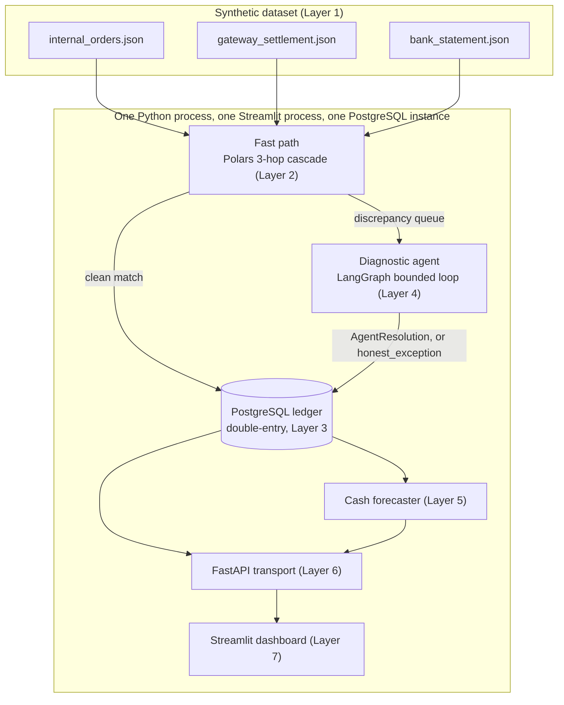

# ZeroDrift

An AI-assisted reconciliation engine that matches orders, gateway settlements, and bank statements — and is honest about the cases it can't confidently resolve, instead of guessing. Built for Razorpay Buildathon Track 04.

## Architecture



**This is a modular monolith, not distributed.** Every box inside "Monolith" above is a Python module called in-process — plain function calls, not network calls between services — sharing one PostgreSQL instance via SQLAlchemy. There is no message broker, no service mesh, no cross-service failure handling, and no Kafka/Spark/streaming layer anywhere in this system. That's a deliberate choice, not a shortcut: this project's correctness claim rests on single ACID transactions (a journal entry and its lines post together or not at all — see the ledger section below) and on being able to reason about the whole pipeline in one process's call stack. A distributed version of this system would trade that provable correctness for operational complexity this problem doesn't need. The only Razorpay-internal fact this build leans on is verified: Agent Studio runs on Anthropic's Claude Agent SDK.

## Domain model

**Money.** `Decimal`, parsed from `str`, at every Pydantic boundary — a `field_validator` rejects a `float` literal outright. Inside Polars, money is integer **paise** (`Int64`), never an inferred/`Float64` column. In Postgres, `NUMERIC`. Exactly two functions convert between the two representations, `to_paise()` / `from_paise()` (`src/common/money.py`), with a zero-drift round-trip test over the full frozen dataset — no ad-hoc conversion exists anywhere else in the codebase.

**Fees, computed per settlement:**
```
gst_on_mdr  = mdr × 18%                    (GST_RATE, src/data/generator.py)
tds_194o    = gross_amount × 0.1%          (TDS_RATE — Section 194-O, reduced from 1% effective 2024-10-01)
net_amount  = gross_amount − mdr − gst_on_mdr − tds_194o     (exact, zero-tolerance invariant)
```
GST paid on the MDR fee is Input Tax Credit — an **asset** (`GST_ITC_RECEIVABLE`), not a liability. TDS withheld under Section 194-O is an advance tax paid on the merchant's behalf — also an **asset** (`TDS_194O_CREDIT`). Every account in the chart of accounts is classified from the **merchant's** books, not the gateway's or the bank's.

**194-O modeling assumption, stated plainly:** this project models the merchant as an e-commerce participant settling through an operator who deducts tax under Section 194-O. It does not resolve the broader, genuinely unsettled debate about whether a pure payment aggregator (as opposed to a marketplace operator) is in scope of that section — that question is left open deliberately here, not dodged.

**UPI has nil MDR, by regulation.** UPI P2M transactions carry zero merchant discount rate, so every UPI record has `mdr = 0` and `gst_on_mdr = 0` with no exceptions — enforced as a Pydantic model validator on `GatewaySettlement` (`src/data/models.py`), not just a generator convention. A UPI settlement with a nonzero MDR line simply cannot be constructed; the generator is correspondingly forbidden from ever placing a `missing_tax_line` anomaly on a UPI record, since "a UPI record with a nonzero tax line to omit" isn't a real transaction that could occur.

## Ledger: largest-remainder UTR batch allocation

Splitting an integer-paise lump-sum bank credit across the 2–4 orders in a `utr_batch` record by naive proportional division almost always leaves 1 to N−1 paise unallocated — enough to fail the ledger's own balance trigger. `src/ledger/allocation.py::allocate_utr_batch` instead floors each order's exact proportional share, then hands out the leftover paise one each to the orders with the largest fractional remainder, so the split always sums exactly to the real bank credit. Any residual larger than that (which would signal an upstream bug, not ordinary rounding) is capped at `±N` paise per batch and posts to a dedicated **`ROUNDING_DIFFERENCE`** expense account instead of being fudged into any one order's amount — asserted directly in `tests/test_ledger.py`, never silently swallowed. On the frozen `challenge_batch_100` dataset every `utr_batch` record allocates with zero residual, so `ROUNDING_DIFFERENCE` carries no activity in that scorecard below — the account exists in the schema for the case where it's needed, and this run happens not to need it.

## Running locally

```
docker compose up -d          # Postgres only -- see docker-compose.yml
source venv/Scripts/activate  # or venv/bin/activate on macOS/Linux
uvicorn src.api.main:app --reload --port 8000
streamlit run src/dashboard/app.py
```

The API applies `src/ledger/db_schema.sql` to the `finance_controller`
database itself on startup if the schema isn't already there (see
`ensure_schema_exists` in `src/ledger/models.py`) -- so a fresh
`docker compose up` (or a `docker compose down -v` reset) doesn't need a
manual `psql -f db_schema.sql` step; the first `uvicorn` start creates it.
`pytest` never touches this database -- it provisions and resets its own
`finance_controller_test` database (`tests/conftest.py`).

## Scorecard

The deterministic block is exact and byte-reproducible for the frozen dataset — regenerated by re-running `python evaluate.py --skip-agent-block` and pasting the real output, never hand-typed (`tests/test_packaging.py` asserts this block matches a fresh run on every test invocation, so it cannot silently drift).

<!-- SCORECARD:DETERMINISTIC:START -->
```text
=== Deterministic block (exact, byte-reproducible for this batch) ===
Fast path resolved:       63 / 100
Agent resolved:           20 / 100
Honest exceptions:        17 / 100
False auto-resolutions:   0   (must be 0)
Adversarial traps caught: 5 / 5   (must be 5/5)
Duplicate credits caught: 2 / 2   (must be 2/2)
Ledger balance check:     PASS
Paise round-trip drift:   0   (asserted 0)

Trial balance (paise):
  AR_GATEWAY_CLEARING      debit=    24,809,496 credit=    25,070,336 net=      -260,840
  CASH                     debit=    27,022,633 credit=             0 net=    27,022,633
  CASH_IN_TRANSIT_UTR      debit=     2,661,609 credit=     2,661,609 net=             0
  GST_ITC_RECEIVABLE       debit=        51,209 credit=             0 net=        51,209
  MDR_EXPENSE              debit=       302,375 credit=             0 net=       302,375
  REVENUE_GROSS            debit=       260,840 credit=    24,809,496 net=   -24,548,656
  SUSPENSE_UNRESOLVED      debit=     1,363,516 credit=     3,952,947 net=    -2,589,431
  TDS_194O_CREDIT          debit=        22,710 credit=             0 net=        22,710
  TOTAL                    debit=    56,494,388 credit=    56,494,388 net=             0
```
<!-- SCORECARD:DETERMINISTIC:END -->

**Agent block — 3 independent live runs, complete.** The agent path is genuinely non-deterministic (CLAUDE.md Sec.5), so this is reported as a min/median/max range across 3 independent live runs, never a single number. All three ran against the frozen dataset with zero cache reuse between them (`data/agent_runs/frozen_1.jsonl`, `frozen_2.jsonl`, `frozen_3.jsonl`), gathered across multiple sittings under Groq's free-tier 200,000-token daily cap — real timestamps days apart, exactly the methodology note above describes, not a shortcut. Zero malformed-output fallbacks across all 111 record-diagnoses (37 × 3).

<!-- SCORECARD:AGENT:START -->
```text
=== Agent block (3 independent live runs -- range, never a single number) ===
Agent resolved (per run):           [20, 20, 20]  out of 20
  min / median / max:               20 / 20 / 20
Correct root_cause_code (per run):  [20, 20, 20]  out of 20
Correct quantified_delta (per run): [19, 18, 19]  out of 20
Honest exceptions from agent path: consistent across all 3 runs? Y
```
<!-- SCORECARD:AGENT:END -->

Root-cause identification was perfect across every run (20/20, all 3 sittings) and all 17 honest-exception records were routed consistently every time. The one real source of variance: `quantified_delta_paise` missed by 1 record on 2 of the 3 runs (19/20, 18/20, 19/20) — every miss traced to the same `cutoff_drift` category, where the model occasionally reports the settlement's full net amount as the delta instead of the correct 0 (fees genuinely matched; only timing was off). Left as a disclosed, real finding rather than "fixed" — it's exactly the kind of run-to-run agent variance this range exists to surface honestly, not paper over.

## Live seed batches: recommended size

**Recommend 60 records or fewer for a live (`source="seed"`) batch, not the frozen dataset's own 100.** A never-before-seen seed needs one real live Groq call per record needing agent judgment, against this key's hard 200,000-token daily cap — and that cap is not just a theoretical ceiling. Verified directly, not guessed (generating real batches and measuring against the real per-record cost, `src/agent/run_log.py::average_real_tokens_per_live_call`): **records=70 fits inside the usable budget (est. 184,389 tokens), records=75 does not (est. 198,048)**. Real per-record cost has ranged ~4,400–11,700 tokens depending on category mix, so 60 is deliberately kept below that measured boundary rather than sitting right at the edge.

Notably, **even the frozen dataset's own size does not fit a fresh day's budget on its own** — a brand-new 100-record seed needs an estimated 252,682 tokens, over the entire daily cap. Triggering `source="frozen"` only ever costs zero live tokens because its 37 discrepancy records are permanently cached (`data/agent_runs/layer4_test_cache.jsonl`), not because 100 records is a safe live-seed size in general. `RECOMMENDED_MAX_LIVE_SEED_RECORDS` (`src/agent/rate_limiter.py`) is the single source of truth for this number, surfaced on the dashboard's "Bring your own seed" card.

A batch that won't fit today's remaining budget fails cleanly with a clear message before any row is posted (`src/orchestration/batch_runner.py`'s pre-flight check) rather than posting partial results — see the two commits from the 2026-09-03 debugging session for the full incident.

## A couple of things worth knowing before you dig in

**LangGraph vs. the Claude Agent SDK.** The bounded diagnostic loop (`src/agent/graph.py`) is built on LangGraph, not the Claude Agent SDK — LangGraph's explicit state-machine model gives direct, inspectable control over exactly the guarantees this layer needs to enforce in code rather than just prompt (the hard 3-tool-call cap, stateless per-record execution with no cross-record memory, a structured `AgentResolution` output the gatekeeper can validate). The Claude Agent SDK is the actual, verified production target for this track (Razorpay's Agent Studio runs on it) — porting to it is confined to the model-calling layer, not a redesign of the graph or tool contracts, since those are already explicit and portable.

**The agent was built and tested on an open-source model, not Claude — here's why.** Claude is the model this is actually designed for, and the only Razorpay-internal fact this project leans on is that Agent Studio runs on Anthropic's Claude Agent SDK — that's the track this build targets. But iterating on an agent means a lot of calls — many records, retries, repeated test runs while things are still being debugged — and that volume doesn't fit inside free Anthropic Console credits. So development runs on Groq's free tier instead, using `openai/gpt-oss-120b`.

That specific model wasn't the original plan, either. The intent going in was Llama 3.3 70B, but by the time this was built, Groq had quietly dropped it from the models their API actually serves — it just wasn't in the list anymore when checked. `gpt-oss-120b` was the largest open-weights model still available on the key, so that's what ended up carrying the actual development and testing.

None of this is a permanent architectural choice — swapping back to Claude for production is a one-line change in `src/agent/graph.py::_build_model()`.

**The agent's evaluation numbers are being gathered across several days, not one sitting — and that's deliberate, not a shortcut.** A full evaluation run means calling the live agent on every record that needs real judgment (20 `agent_resolved` + 17 `honest_exception` = 37 of them, per the frozen dataset's `ground_truth.json`), and doing that three separate times so the reported result is an honest min/median/max rather than one lucky run dressed up as three. Groq's free tier caps out at 200,000 tokens a day, and three full runs need roughly three times that. So the three run logs — `data/agent_runs/frozen_1.jsonl`, `frozen_2.jsonl`, `frozen_3.jsonl` — genuinely have timestamps days apart. That's the token budget talking, not neglect.
